# 🚘 Road Judge AI (AI 문철) - 교통사고 과실비율 자동 산정 프로그램


> **"몇 대 몇?"** > 블랙박스 영상을 입력받아 AI가 사고 상황을 정밀 분석하고, 대한민국 법원 판례 기반의 과실 비율을 예측해주는 서비스입니다..

---

## 📖 프로젝트 소개

이 프로젝트는 교통사고 영상을 기반으로 사전에 정의된 데이터셋(434가지 상황)과 매칭하여 **최종 과실 비율(A:B)을 산정해주는 웹 기반 분석 프로그램**입니다.
사용 목적에 따라 추론 속도와 정확도를 선택할 수 있도록, 두 가지 다른 아키텍처로 학습된 **듀얼 AI 모델 그룹(정밀 분석 / 신속 처리)**을 병렬로 제공합니다.

- **[정밀 분석 모델] (VideoMAV2 적용):** 복잡한 Loss(Focal, LDAM) 조정을 거친 무거운 아키텍처로, 시간이 소요되더라도 깊이 있는 특징 파악과 높은 정확도를 제공합니다.
- **[신속 처리 모델] (ResNet3D + I3D 적용):** 효율성이 검증된 아키텍처를 적용하여 리소스 소모를 줄이고 1차 판독용으로 신속하게 결과를 반환합니다.

```mermaid
graph LR
    User[사용자] -->|영상 업로드| Client[React Frontend];
    Client -->|API 요청| Server[Flask Backend];
    Server -->|병렬 처리| AI_Engine{AI Inference Engine};
    
    subgraph "Dual AI Models"
    AI_Engine -->|Deep Analysis| Model_A[정밀 분석 모델<br>VideoMAV2];
    AI_Engine -->|Fast Analysis| Model_B[신속 처리 모델<br>ResNet3D+I3D];
    end
    
    Model_A --> Feature_Extraction[특징 추출<br>장소/유형/차량A/차량B];
    Model_B --> Feature_Extraction;
    
    Feature_Extraction --> Logic[과실비율 매칭 알고리즘];
    Logic -->|Result JSON| Client;
```



---

## 📁 디렉토리 구조 (Monorepo)

프론트엔드와 백엔드를 명확히 분리한 Monorepo 구조를 채택하였습니다.

```text
road-judge-ai/
├── frontend/                 # React 프론트엔드
│   ├── public/
│   ├── src/
│   └── package.json
└── backend/                  # Flask 기반 백엔드 및 AI 추론 모듈
    ├── app.py                # 메인 API 서버
    ├── vlm_code.py           # VLM 연동 및 보안 모듈 (.env 사용)
    ├── run_backend.sh        # 서버 실행 스크립트
    ├── configs/              # 모델별 설정 파일 (*_config.py)
    ├── data/                 # 과실비율 산정 데이터셋 (*.csv)
    └── weights/              # (Git 제외) 모델 가중치 파일 (*.pth)
```
*(주의: 8개의 `.pth` 모델 가중치 파일과 `.env` 파일은 보안 및 용량 문제로 Git에 업로드되지 않습니다.)*

---

## 🚀 설치 및 실행 (PM2 무중단 배포)

이 프로젝트는 **AWS EC2 (Ubuntu)** 환경에서 **Conda**와 **PM2**를 사용하여 프론트엔드와 백엔드를 백그라운드에서 동시 구동합니다.

### 1. 환경 설정 및 의존성 설치
**Backend (Conda 환경)**
```bash
conda activate aimuncheol
cd backend
pip install -r requirements.txt
```

**Frontend**
```bash
cd ../frontend
npm install
```

### 2. 서버 실행
```bash
# 기존 프로세스 정리
pm2 delete all

# 프론트엔드 실행 (frontend 디렉토리 기준)
pm2 start npm --name "frontend" --cwd ./frontend -- start

# 백엔드 실행 (backend 디렉토리 기준)
pm2 start ./run_backend.sh --name "backend" --cwd ./backend

# 현재 상태 저장 (재부팅 시 자동 실행)
pm2 save
```

---

## 📊 AI 모델 성능 비교

동일하게 4가지 클래스(장소, 특성, 가해차량, 피해차량)를 예측하지만, 목적에 맞춰 아키텍처와 Loss를 다르게 튜닝하였습니다.

### 🥇 모델 1. 정밀 분석 모델 (VideoMAV2)
> **특징:** 연산량이 무거우나, LDAM 적용을 통해 데이터 불균형을 해소하고 정밀도를 높임.

| Stage | 핵심 변경점 | Model 1 (장소) | Model 2 (특성) | Model 3 (차량A) | Model 4 (차량B) |
|---|---|---|---|---|---|
| 1. Baseline | CE, frame interval 2 | Top1: 82.20 | Top1: 72.93 | Top1: 67.12 | Top1: 65.43 |
| 2. Focal | CE → Focal 탐색 | Top1: 71.86 | Top1: 65.12 | Top1: 81.75 | - |
| **3. 최종 (LDAM)** | Focal → LDAM | **Top1: 73.32** | **Top1: 68.08** | **Top1: 67.25** | - |

### 🥈 모델 2. 신속 처리 모델 (ResNet3D + I3D)
> **특징:** 효율성이 검증된 아키텍처. Fine-tuning과 Focal 재튜닝을 거쳐 최적의 밸런스 도달.

| Stage | 핵심 변경점 | Model 1 (장소) | Model 2 (특성) | Model 3 (차량A) | Model 4 (차량B) |
|---|---|---|---|---|---|
| 1. Baseline | CE, frame interval 2 | 80.85 (Acc) | 71.80 (Acc) | 66.46 (Acc) | 66.31 (Acc) |
| 2. Focal 튜닝 | α, γ 파라미터 튜닝 | 81.17 | 72.24 | 66.52 | 66.62 |
| **3. 최종 (Fine-tune)**| LR 1e-5 + γ 조정 | **82.42** | **72.93** | **68.66** | **68.82** |

---

## 🌐 API 명세서

### `POST /api/analyze`
업로드된 블랙박스 영상을 두 모델 그룹에 통과시켜 각 항목의 Top-K 예측값과 최종 과실비율을 반환합니다. (h264 코덱 자동 변환 지원)

- **Request Body:** `multipart/form-data` (key: `video`, file: `.mp4`)
- **Response Format:** Server-Sent Events (SSE) 기반 실시간 스트리밍 JSON

```json
{
  "type": "complete",
  "input_data": {
    "은석": [ ... ], // 정밀 모델 분석 결과 배열
    "형선": [ ... ]  // 신속 모델 분석 결과 배열
  },
  "fault_results": {
    "은석": { "best": { "fa": 80, "fb": 20, "role_a": "가해자" }, "alts": [ ... ] },
    "형선": { "best": { "fa": 70, "fb": 30, "role_a": "가해자" }, "alts": [ ... ] }
  }
}
```

---

## 👨‍💻 Contributors

| Name | Role | Profile |
|:---:|:---:|:---:|
| **나형선** | Backend / Frontend / AI | |
| **송수민** | Backend / Frontend / AI | |
| **이예영** | Backend / Frontend / AI | |
| **임은석** | Backend / Frontend / AI | |
| **함성민** | Backend / Frontend / AI | |


---
*Copyright © 2026 Road Judge AI Team. All Rights Reserved.*
